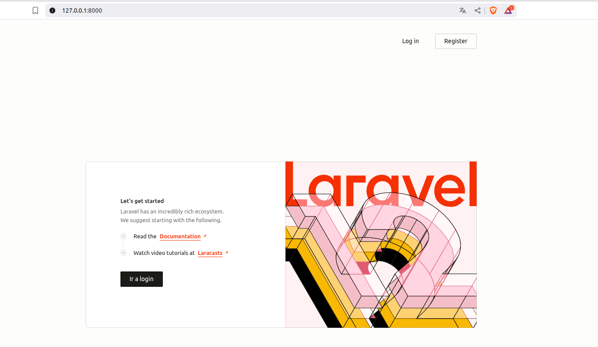
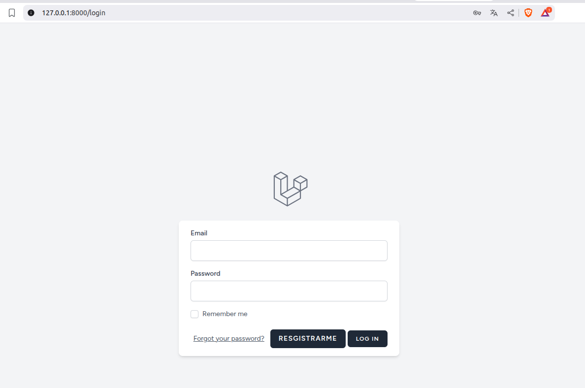
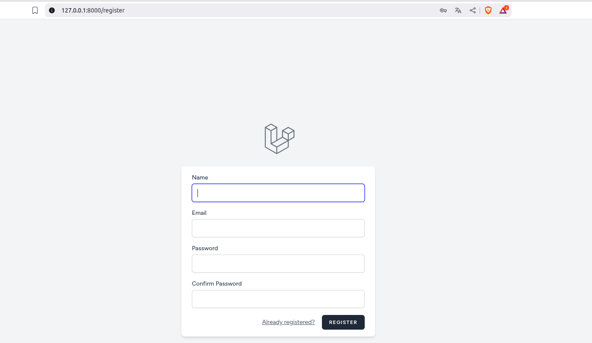
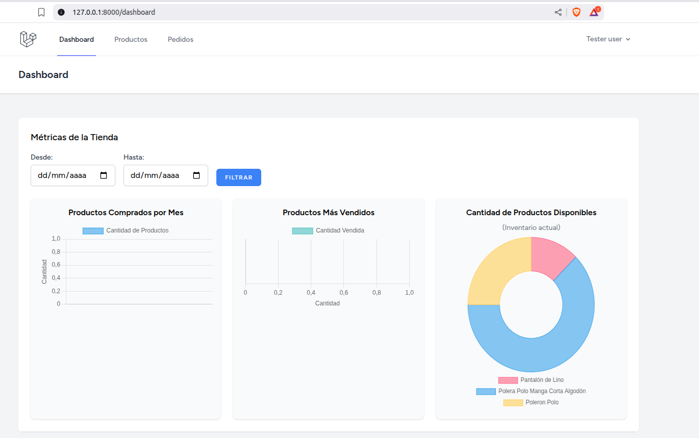
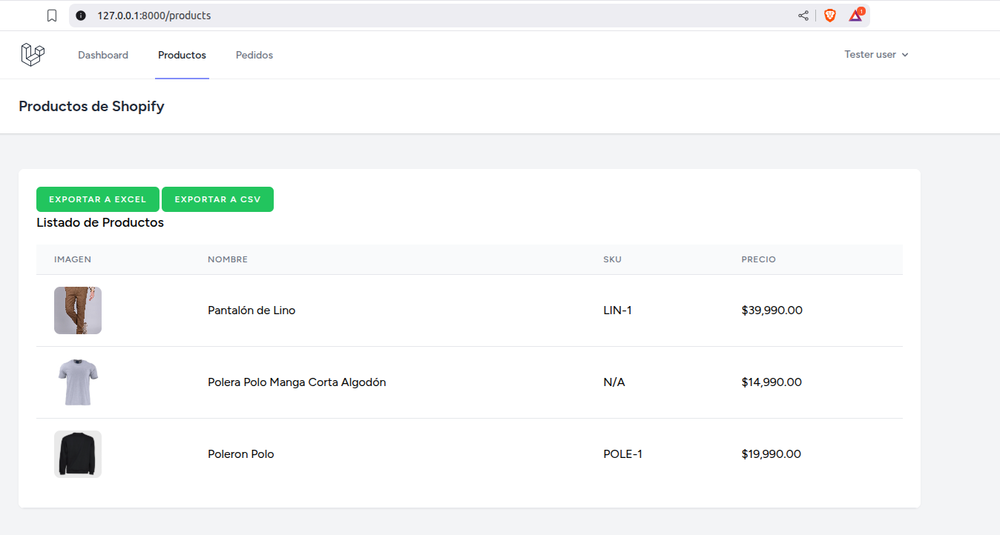
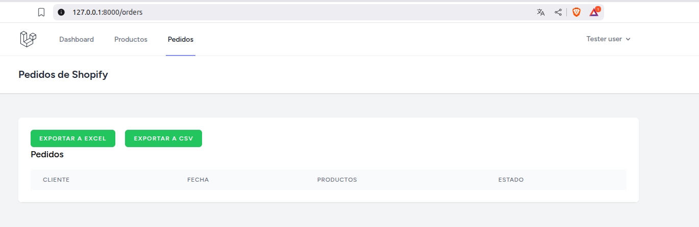

# 🛍️ Mi tienda en Shopify - Desafío Amplifica

Este repositorio contiene la solución para la prueba técnica de **Amplifica**, que consiste en el desarrollo de una aplicación backend utilizando **Laravel** para integrar API's externas de plataformas e-commerce.  
El objetivo es **consumir estas API's de terceros**, manejar credenciales de forma segura 🔐 y construir soluciones **escalables y robustas** ⚡.

---

## 📋 Requisitos

Antes de comenzar, asegúrate de tener las siguientes herramientas instaladas en tu máquina 💻:

- [Git](https://git-scm.com/)  
- [Composer](https://getcomposer.org/)  
- [Node & npm](https://docs.npmjs.com/downloading-and-installing-node-js-and-npm)  

Además, este proyecto está desarrollado con las siguientes versiones:

- **Laravel 12**  
- **PHP 8.2^**  
- **Node 20.10^**  

---

## 🚀 Primeros pasos

### 📥 Descarga del repositorio
1. **Clonar el repositorio**  
   ```bash
   git clone https://github.com/efuentealbaCh/desafio-amplifica-v2.git
   ```
2. **Acceder al directorio**  
   ```bash
   cd desafio-amplifica-v2
   ```

### ⚙️ Instalación de dependencias y preparación de entorno
1. **Instalación de paquetes**  
   ```bash
   npm install
   composer install
   ```
2. **Nota**  
   En caso de ser necesario:  
   ```bash
   npm run build
   ```  
   para asegurar que la aplicación se construya correctamente ✅.

---

## ▶️ Ejecución del programa

### 🔑 Consideraciones importantes
1. **Usuarios 👥**  
   La administración de usuarios y la parte visual están gestionadas gracias a **Breeze**, que se encarga de toda la parte de autenticación y registro.  

2. **Base de datos 🗄️**  
   Se usa por defecto **SQLite** en local, lo que permite la correcta interacción con Breeze.  
   Además, se deja un **usuario de prueba** para acceder:  
   ```text
   email: tester.user@gmail.com
   password: 123456789
   ```

3. **Pedidos 📦**  
   No hay registro de pedidos actualmente, por lo que es necesario revisar la lógica de las peticiones.

4. **Pruebas unitarias 🧪**  
   Breeze genera varias pruebas unitarias por defecto.  
   Por lo tanto, al ejecutar los tests, puede que aparezcan más casos de los mencionados en la sección correspondiente.

5. **Archivo .env ⚠️**  
   Para probar la integración completa, se requiere el archivo con credenciales.  
   Contactar al desarrollador vía email:  
   📧 **efuentealba038@gmail.com**

---

### 💻 Comandos de apertura

1. **Abrir terminal**  
   Es necesario abrir **dos pestañas de terminal**:  

   - Primera terminal 👉  
     ```bash
     php artisan serve
     ```
   - Segunda terminal 👉  
     ```bash
     npm run dev
     ```

2. **Acceder al sitio web 🌐**  
   Una vez levantado el servidor, ingresa a:  
   ```bash
   http://127.0.0.1:8000
   ```

   Podrás hacer login con el usuario de prueba o registrar uno nuevo.

3. **Login y registro 🔐**  
   - Login:  
     ```bash
     http://127.0.0.1:8000/login
     ```
   - Registro:  
     ```bash
     http://127.0.0.1:8000/register
     ```

---

### 🧭 Probando el sistema

👉 Una vez logueado, serás redirigido a la sección de **Productos**.  
Desde allí podrás navegar con la **barra superior (navbar)** hacia las diferentes funcionalidades.  

🔎 Toda la lógica de extracción de datos está en:  
`app/Services/ShopifyService.php`

1. **Métodos importantes ⚙️**
   - **__construct** → Genera la instancia del cliente para realizar la petición inicial a Shopify.  
     Maneja dominio, secret_key y timeout ⏱️.
   - **makeRequest** → Realiza las peticiones a la API de Shopify (productos y pedidos).  

2. **Vistas de productos, pedidos y dashboard 📊**
   - Permiten visualizar y exportar datos.  
   - El **Dashboard** incluye un buscador por fecha 📅 que filtra pedidos y muestra gráficos:  
     - Pedidos mensuales.  
     - Productos más vendidos.  



Vista de inicio de pagina inicial, se aprecian botones de login y register.


Vista para inicio de sesión.


Vista para registro de usuarios.


Vista de dashboard, se pueden apreciar los gráficos de tre mestricas, además en la parte superior se aprecia un navbar para facilitar la navegación en el sitio web.


En la imagen se puede apreciar la vista de los poductos disponibles en la tienda, tambien se puede apreciar la presencia de los botones de exportar en excel y en csv.


En la imagen se puede apreciar la vista de los pedidos disponibles en la tienda, tambien se puede apreciar la presencia de los botones de exportar en excel y en csv.

---

## 🧪 Pruebas unitarias

### 📌 Ejecución de pruebas
- Ejecutar todas las pruebas:  
  ```bash
  ./vendor/bin/phpunit
  ```

- Ejecutar pruebas específicas por archivo:  
  ```bash
  ./vendor/bin/phpunit tests/Unit/Services/ShopifyServiceTest.php
  ./vendor/bin/phpunit tests/Unit/Exports/ProductsExportTest.php
  ./vendor/bin/phpunit tests/Unit/Services/ShopifyServiceTest.php
  ```

- Ejecutar un método específico:  
  ```bash
  ./vendor/bin/phpunit --filter nombre_del_metodo
  ```
  Ejemplo:  
  ```bash
  ./vendor/bin/phpunit --filter test_index_displays_products_from_shopify
  ```

---
